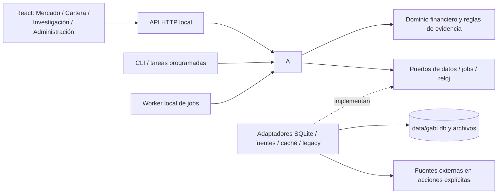

# Arquitectura de GABI

Estado: decisión vigente desde 2026-09-29. Registro: [ADR 0001](adr/0001-local-modular-monolith.md).
Normas para implementaciones: [AGENTS.md](../AGENTS.md). Se aplica al código nuevo
y a la evolución del existente mediante [su plan de migración](architecture/legacy-migration.md).

## Decisión y estado real

GABI será un **monolito modular local**: una aplicación Python con dominio,
casos de uso y adaptadores separados; un cliente React por capacidades; SQLite
y archivos compartidos en `data/`. API y worker son procesos del mismo backend,
con los mismos modelos y servicios. No requieren despliegues independientes.

El backend conserva 76 módulos planos como compatibilidad; [F7](https://github.com/juavepui/GABI/issues/91) los retira por fases. Las hojas de F7.4
[delegan sus cálculos en el dominio](architecture/f7-domain-leaves.md), incluidos
[indicadores y estadísticas](architecture/f7-quantitative-domain.md) y
[scoring y fundamentos SEC](architecture/f7-fundamental-domain.md), mientras conservan consumidores legacy.
[Las reglas de evidencia](architecture/f7-evidence-rules.md) comparten dominio y
caso de uso entre API y ledger.
[El catálogo de estudios](architecture/f7-evidence-catalog.md) usa fuentes explícitas
y verificación cacheada con invalidación por archivos.
[Calidad de datos](architecture/f7-data-quality.md) comparte reglas de dominio y
casos de uso con reloj explícito; conserva pendientes sus lectores de compatibilidad.
[Eventos corporativos](architecture/f7-corporate-events.md) retira el módulo plano y
comparte análisis de fechas, sincronización explícita y almacenamiento.
[El análisis de insiders](architecture/f7-insider-analysis.md) interpreta Form 4
y resume operaciones con filas y fecha explícitas. [Su sincronización](architecture/f7-insider-sync.md)
comparte puertos de documentos y almacenamiento; conserva pendiente la resolución CIK legacy.
[El arnés de variantes](architecture/f7-variant-validation.md) comparte protocolo
y métricas con un runner explícito y conserva la fachada usada por R3 congelado.
[La identidad y estado del modelo](architecture/f7-model-policy.md) usa reglas
de dominio con pesos de referencia inmutables compartidas por Mercado y evidencia.
[La extensión de membresía histórica](architecture/f7-membership-extension.md)
reproduce cambios revisados en dominio, con ancla, ledger y día explícitos.
[Las correcciones de etiquetas históricas](architecture/f7-ticker-corrections.md)
validan nominaciones y sus intervalos en dominio, conservando los recursos revisados.
[El plan prospectivo](architecture/f7-prospective-plan.md) comparte cálculo y hash
con puertos explícitos de integración/publicación y retira su módulo plano.
[El inventario histórico anual](architecture/f7-historical-data-audit.md) comparte
reglas de cobertura y caso de uso, con lecturas acotadas y exportación explícita.
[La cobertura trimestral 1996–2015](architecture/f7-quarterly-coverage.md) retira
su módulo plano, conserva los cinco artefactos y procesa una empresa por lectura.
[Los factores académicos](architecture/f7-academic-factors.md) comparten dominio
OLS/HAC y carga con puertos explícitos de caché/fuente en el worker.
[El archivo WIKI](architecture/f7-wiki-prices.md) comparte descarga e importación
con puertos explícitos, caché acotada y validación de precios en dominio.
[Decisiones](architecture/f7-decisions.md), [Factor Lab](architecture/f7-factor-analysis.md)
y [seguimiento de rankings](architecture/f7-ranking-evaluation.md)
retiran sus módulos planos. F2 ha migrado el cálculo
y los filtros del Screener a casos de uso/dominio compartidos y añadido la
[API local de consulta](local-api.md), con SQL de solo lectura y caché por lotes.
F3 incorpora el [cliente React local](../frontend/README.md)
con Screener, ficha y tipos generados desde OpenAPI. F4 añade la cola SQLite,
worker local y Administración en [#66](https://github.com/juavepui/GABI/issues/66).
F5 incorpora [Cartera y los recorridos de Mercado](architecture/f5-portfolio-market.md)
con el mismo almacenamiento local y cálculos compartidos.
F6 migra [Investigación, Administración y el arranque bajo un solo origen](architecture/f6-research.md)
y retira Streamlit tras verificar la equivalencia de cada flujo.
No se presenta el destino como
una refactorización ya completada ni se atribuye una mejora de velocidad sin medirla.

La elección permite reutilizar cálculos, estudiar estrategias reproducibles y
mantener el coste operativo local. Separamos responsabilidades sin crear servicios
de red para cada sección, ni una clase/repositorio por cada tabla o función.

## Ejecución y flujo



Las flechas continuas muestran llamadas durante la ejecución; los imports siguen
la matriz de capas siguiente. La API usa interfaces de aplicación; `bootstrap.py`
construye los adaptadores concretos y los inyecta. El worker recibe identificadores
y parámetros, no conexiones SQLite ni DataFrames enviados desde el navegador.

En desarrollo Vite y FastAPI tendrán orígenes locales con CORS limitado. Al finalizar
F6, FastAPI servirá el build del cliente bajo el mismo origen. El arranque local
incluirá el worker cuando un flujo lo necesite, con parada controlada y logs. No se
abre escucha pública ni se crea una dependencia de nube.

## Backend: estructura y responsabilidades

```text
backend/src/
  gabi/
    domain/{market,portfolio,research}/
    application/{market,portfolio,research,administration}/
    infrastructure/{storage,providers,cache,jobs,legacy}/
    infrastructure/settings.py
    <módulos planos existentes durante la transición>
  gabi_api/
    bootstrap.py
    routes/                         # HTTP /api/v1
    schemas/                        # formatos públicos, OpenAPI
  gabi_cli/
    bootstrap.py
    commands/                       # adaptadores CLI/worker/scheduler
    research/bootstrap.py           # comandos de investigación reproducibles (ADR 0002)
backend/tests/
```

Crear estas carpetas al entregar su primer caso de uso. Una capacidad pequeña
puede empezar con un archivo; dividir por responsabilidad cuando crezca. No se
necesita una subcarpeta ni un objeto para cada verbo.

| Capa | Contenido | Dependencias internas permitidas |
| --- | --- | --- |
| `domain` | Scoring, elegibilidad, costes, rentabilidades, riesgo, identidad y reglas de evidencia, a partir de entradas explícitas | Dominio |
| `application` | Consultar ranking/ficha, preparar actualización, registrar cartera/estudio; DTO internos y puertos | Aplicación y dominio |
| `infrastructure` | SQL, proveedores, lecturas/escrituras, caché, ejecución de jobs y puentes legacy | Infraestructura, aplicación y dominio |
| API/CLI | Validación de entrada/salida, traducción de errores, invocación del caso de uso | Su adaptador, aplicación y dominio |
| `bootstrap.py` de API/CLI | Composición de dependencias y ciclo de vida | Las capas anteriores |

El dominio no conoce Streamlit, FastAPI, HTTP, SQLite, ficheros ni ajustes globales.
Puede usar NumPy/pandas para operar sobre datos ya suministrados. Los casos de uso
reciben repositorios específicos, configuración y reloj; un `Protocol` se introduce
cuando existe un límite de I/O o de compatibilidad publicada que inyectar.
No añadir interfaces a funciones puras nuevas. Evitar reexports masivos en
`__init__`; importar desde el módulo que define el contrato.

Los DTO internos usan dataclasses/estructuras tipadas. Los schemas HTTP transforman
esas salidas a JSON finito y publican unidades, fechas, identidad, procedencia y
estado de evidencia. DataFrames y objetos de framework no cruzan HTTP. El frontend
genera sus tipos de OpenAPI; no mantiene una segunda definición manual del
modelo financiero. [FastAPI documenta routers separados y dependencias](https://fastapi.tiangolo.com/tutorial/bigger-applications/).

Un ejemplo de frontera: `GetRanking` recibe una consulta y un puerto de lectura;
el adaptador SQLite/legacy carga solo los datos necesarios; el dominio calcula
con los motores existentes; el caso de uso aplica selección/filtros; la ruta
serializa. La página React consume ese contrato. No hay scoring en la ruta ni en JS.

Las capacidades pueden reutilizar funciones de dominio. Una aplicación no importa
otro adaptador de aplicación para atajar una frontera: una coordinación común vive
en un caso de uso explícito. Los helpers de presentación antiguos terminan en
`app/` durante la transición o desaparecen con sus consumidores; no pasan al dominio.

## Frontend: capacidades y estado

```text
frontend/src/
  main.tsx
  app/                              # router, layout y composición
  features/
    market/                         # Screener, ficha, comparación, macro
    portfolio/                      # posiciones, simulaciones, diario
    research/                       # protocolos, ensayos, evidencia
    administration/                 # datos, calidad, configuración, jobs
    # Cada feature tiene index.ts y componentes/hooks/api propios según necesite.
  shared/
    api/                            # HTTP transport y tipos OpenAPI generados
    ui/                             # controles shadcn/ui y presentación común
    lib/                            # formato y utilidades puras
    assets/
```

`app` compone las features mediante su `index.ts` público. Una feature no importa
otra feature; la coordinación vive en `app`, en un contrato backend o en un
elemento común que realmente sea reutilizable. `shared` nunca depende de features
ni conoce una estrategia. No trasladar allí lógica de un único flujo para eludir
una frontera. Los componentes llaman hooks/funciones de su feature; el acceso
HTTP efectivo está en `shared/api`, sin clientes alternativos por pantalla.

El estado se mantiene en su propietario más cercano. Filtros, orden y paginación
compartibles van en la URL; interacciones efímeras en React; datos remotos en una
capa de consultas común de la feature. No duplicar respuestas en varios estados
globales ni añadir Redux u otra librería de estado sin un problema concreto.
Cancelación y deduplicación evitan respuestas antiguas al cambiar filtros.
[React recomienda estado mínimo y flujo de datos en un sentido](https://react.dev/learn/thinking-in-react).

React formatea fracciones a porcentajes según la unidad del contrato y muestra
ausencia, obsolescencia, error y progreso. No recalcula selección, métricas o
evidencia, ni convierte un modelo `FROZEN` en validado. Todas las restricciones
Investor/Research se verifican también en el backend por URL directa.

## Consultas, comandos y jobs

Una consulta nueva lee caché/datos locales y produce una respuesta. No descarga,
inicializa esquemas, escribe pesos, registra experimentos ni recalcula backtests.
Una caché ausente se comunica como ausente; una lectura no llama a un helper
legacy que obtenga datos de Internet si no encuentra el archivo. Estas condiciones
se comprueban con tests que prohíben red/escrituras, no solo con el nombre del método.

Un puente no hace monkeypatch de `config` o de conexiones por petición para
convertir un helper mutable en lectura: el proceso HTTP atiende operaciones
concurrentes. Settings y repositorios son explícitos; la compatibilidad F1 de
arranque se conserva. El cálculo publicado se invoca con sus inputs declarados.

Las escrituras cortas son comandos explícitos con transacciones y validación de
evidencia. Las descargas, reconstrucciones, auditorías o backtests largos crean un
job persistente. F4 usa un worker local y concurrencia de cálculo limitada;
ni una tarea de fondo HTTP ni un navegador abierto garantizan su continuidad.

SQLite guarda metadatos, parámetros, progreso, checkpoints y referencias al
resultado. Estados previstos: `queued`, `running`, `succeeded`, `failed`,
`cancelled`. El worker usa bloqueo de proceso y lease renovable. Tras reiniciar,
un job interrumpido queda `failed` con `worker_interrupted`, sin resultado publicado;
el usuario puede reencolar un refresco incremental con otra clave.
Los cálculos pesados se aíslan del proceso HTTP; los reintentos de fuentes respetan
sus límites. Los resultados grandes permanecen en archivos con referencias y
hashes, no en respuestas HTTP completas ni en el estado de React.

La conexión SQLite pertenece a una operación/proceso; transacciones de escritura
cortas, consultas por lotes y parámetros SQL. WAL mantiene la concurrencia de
lectura, pero SQLite sigue teniendo un escritor a la vez; más workers no implican
más rendimiento. [Documentación de SQLite WAL](https://www.sqlite.org/wal.html).
No se añade un ORM para envolver todas las tablas existentes.

## Rendimiento, RAM y conservación de datos

Los aproximadamente 83 GB de `data/` siguen compartidos, fuera de ambos proyectos.
No se copian ni se recorren para arrancar/abrir una pantalla. Una operación define
universo, periodo, columnas, tamaño de lote y límite de respuesta. Se evita cargar
toda la base en RAM o ejecutar una consulta por símbolo cuando existe una lectura
por lotes. La paginación de ranking es una decisión backend reproducible.

La caché de cálculos se identifica por versión de modelo/código, configuración,
universo/identidad, fecha de corte y revisión de los inputs. Filtros/paginación se
aplican sobre el ranking base cuando sea equivalente. Correcciones históricas
invalidan resultados aunque la última fecha no cambie. TTL por sí solo no acredita
integridad; no sustituir hashes de evidencia por mtime o última fecha.

Los hashes completos se calculan al producir/verificar un snapshot o resultado,
no en cada render. La revisión de la caché de mercado combina la conexión SQLite
persistente (`PRAGMA data_version`), identidad y marcas de DB/WAL, contenido del
universo y pesos. Cada commit en `gabi.db` de un writer legacy o del worker
cambia esa revisión; la lectura la comprueba de nuevo antes de entregar el
ranking. Las transiciones de la cola en `gabi_jobs.db` no invalidan rankings.
Esta revisión no es un hash probatorio. Cada resultado de job se publica mediante
reemplazo atómico de archivo y SHA-256 almacenado con el cambio de estado. Los
artefactos publicados se leen por referencias exactas; no se sobrescriben para limpiar caché. La retención
solo afecta a resultados regenerables mediante una política explícita y probada.

Cada optimización registra fixture/input, tiempo frío/caliente, máximo de memoria,
volumen de filas y consultas. Se comparan condiciones iguales y selección,
métricas, costes, fechas y unidades idénticos. Los umbrales iniciales se fijan al
medir F2/F3; no se inventan cifras ni se ponen cronómetros frágiles en tests unitarios.
F4 incluye reinicio/concurrencia y F5/F6 ventanas históricas y archivos grandes.

Medición F4 reproducible con `backend/.venv/Scripts/python.exe scripts/measure_jobs.py`
en Windows/Python 3.12: 1000 símbolos sintéticos, tres tablas de 1000 filas,
60 lecturas de lista en tres hilos y una auditoría ejecutada por worker:
0,086 s; working set del proceso 79,1 → 82,3 MiB (pico observado), pico de
asignaciones Python 0,5 MiB. Esta medida acota el flujo de auditoría y cola
de la fixture, no la RAM de un refresco de 500 empresas ni de un backtest sobre
los 83 GB locales. Esas operaciones requieren mediciones propias antes de
fijar presupuestos de memoria o aumentar la concurrencia.

## Conservación de evidencia y reglas de cumplimiento

La migración no cambia una estrategia por accidente. Los 18 archivos de
`backend/legacy-engine-hashes.json` y sus artefactos permanecen verificables.
Si un cambio de motor hace falta, se crea una versión nueva con procedencia
explícita; no se cambia el hash esperado de una publicación antigua. No abrir
holdouts ni generar ensayos para comprobar imports, rutas o rendimiento de UI.

| Control | Qué comprueba | Qué se comprueba además |
| --- | --- | --- |
| `scripts/check_architecture.py` en CI | Capas Python, imports estáticos/dinámicos literales, I/O directo conocido, ciclos nuevos y deuda legacy exacta | Equivalencia, efectos, revisión de puertos/adaptadores |
| `frontend/scripts/check-architecture.mjs` en CI | AST TS/JS, imports/reexports/types/lazy, aliases, fronteras, ciclos y transporte HTTP común | Estado React, unidades, UX y contrato HTTP |
| Guardas de hashes/registro y mypy existentes | Código publicado, evidencia y deuda de tipos exacta | Versionado y validación independiente de modelos |
| Tests de cada fase | Resultados, null/unidades, GET sin efectos, persistencia y recuperación | Medición con datos acotados y revisión de cambios |

La guarda frontend usa [la API del compilador TypeScript](https://github.com/microsoft/TypeScript/wiki/Using-the-Compiler-API),
con una versión fijada y pruebas de sus reglas; comprueba las pantallas React,
sus índices públicos y el transporte compartido. La CI verifica además contrato,
lint, tipos, build y flujos de navegador contra una API temporal. No usa búsquedas por texto que interpreten
comentarios como imports. Las guardas no prueban toda la semántica: callbacks,
efectos ocultos o fórmulas duplicadas requieren pruebas de comportamiento y revisión.

La deuda plana está enumerada por archivo e import en
`.github/architecture-legacy.json` (82 módulos backend tras #87, #88 y #89, ADR 0002).
La CI rechaza módulos planos nuevos y dependencias legacy nuevas. Al eliminar
dependencias se retiran sus excepciones. Compara además el inventario con el primer
padre Git (`HEAD^`, o base del merge de una PR): ampliar la lista también falla.
Tras F6, la misma guarda rechaza cualquier import de Streamlit en el backend y
su declaración como dependencia Python, incluso dentro de los módulos legacy.
La primera introducción crea el inventario; después solo puede disminuir.
Los ciclos íntegramente legacy se conservan
temporalmente; cualquier ciclo que incorpore una capa nueva falla. No existe una
excepción genérica para código nuevo ni una renovación automática del baseline.

Un cambio de esta decisión requiere ADR con problema, alternativas, impacto,
migración y validación; actualizar reglas y pruebas en el mismo cambio. No copiar
este documento en varios sitios: los README, AGENTS e issues enlazan esta fuente.
